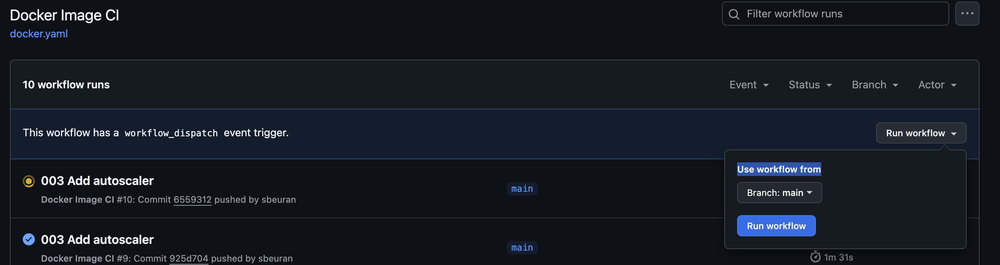

# Therapieland Assignment project
The project aims at provisioning infrastructure and deployment of an application into GCP. 

The proposed architecture diagram is below:

## GCP initial configuration
1. Create new project, say `Therapieland`
2. Create service account for `terraform`, give it an `Editor` and a `Compute Network Admin` roles.
3. Generate key for `terraform` service account and save it, say in file `therapieland-terraform-key.json`
4. Install `gcloud cli` as described here https://cloud.google.com/sdk/docs/install
5. Login as `terraform` service account using `gcloud cli` by providing saved `key json` file location.
```bash
gcloud auth activate-service-account --key-file=therapieland-terraform-key.json
```
6. Create service account for `github pipelines`, give it a `Kubernetes Engine Developer` role.
7. Generate key for `github pipelines` service account and save it, say in file `therapieland-github-key.json`
## Terraform
1. Navigate to the `terraform` directory
```bash
cd terraform
```
2. Initialise terraform
```bash
terraform init
```
3. Update the `tfvars/default.tfvars` as needed
4. Apply the terraform configuration
```bash
terraform apply --var-file=tfvars/default.tfvars
```

## Fill in the required parameters for CI/CD pipeline in GitHub Action Secrets.
1. `Kubeconfig` content
```bash
terraform output -raw kubeconfig
```
Copy the output to the Secret `KUBECONFIG_DATA`

2. `Database` IP address (private)
```bash
terraform output -raw therapieland-db-host
```
Copy the output to the Secret `DB_HOST`

4. `Database` user.
You provided this password via `Terraform` variable `gcp-database-instance-user` when executed `terraform apply`. Take it and copy to the 
secret called `DB_USER`

4. `Database` password.
You provided this password via `Terraform` variable `gcp-database-instance-password` when executed `terraform apply`. Take it and copy to the 
secret called `DB_PASS`

4. `Database` name.
You provided this password via `Terraform` variable `gcp-database-name` when executed `terraform apply`. Take it and copy to the 
secret called `DB_NAME`

5. `Gcloud key json file` content.
You saved file called `therapieland-github-key.json` earlier during `GCP initial setup`. Save it's content in a secret called `GCLOUD_SA_KEY_JSON`.

6. `Docker hub` credentials. Save your docker hub `username` and `password` in secrets called `DOCKERHUB_USERNAME` and `DOCKERHUB_PASSWORD` respectively.

## Running the app:
New deployment is triggered on push into `main` branch of the project.
Also, it's possible to run it manually by hitting the button in `Github`. Open https://github.com/sbeuran/therapieland-assignment/actions/workflows/docker.yaml, like on the image below:


## Getting credentials to the kubernetes and accessing the service
1. Get the `GKE` kubeconfig
```bash
terraform output -raw kubeconfig > therapieland.kubeconfig
```
2. Set the kubeconfig location:
```bash
export KUBECONFIG=$(pwd)/therapieland.kubeconfig
```
3. Login with `gcloud`
```bash
gcloud auth login
```
4. Update the current project id, used by `gcloud`, so if for instance your project id is `therapieland-512451`:
```bash
gcloud config set project therapieland-512451
```
6. Install `gke-gcloud-auth-plugin` as described here
https://cloud.google.com/blog/products/containers-kubernetes/kubectl-auth-changes-in-gke.
For MAC users - just run 
```bash
gcloud components install gke-gcloud-auth-plugin
```
7. Check pods in `therapieland` namespace
```bash
kubectl get pods -n therapieland
```
8. Get public IP of the service (`EXTERNAL-IP`)
```bash
kubectl get svc -n therapieland therapieland-service
```
Navigate to the provided IP in browser (port is `8080`)

### Testing Horizontal Pod Autoscaler
1. Run the following to get info about hpa:
```bash
watch kubectl get hpa -n therapieland
```
2. You can simulate a huge load by accessing the endpoint with Postman
3. See how the number of replicas goes up